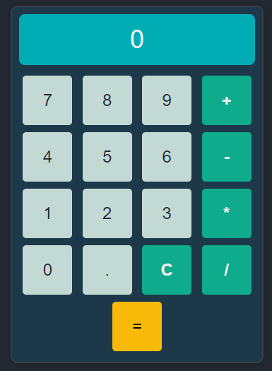

# Calculator

The Calculator is a simple web-based calculator application that allows users to perform basic arithmetic calculations. With an easy-to-use interface and responsive design, it provides a convenient way to quickly compute mathematical operations.

## Features

- Addition, subtraction, multiplication, and division operations are supported.
- Clear button (C) to reset the calculator to its initial state.
- Equal button (=) to evaluate the expression and display the result.
- Real-time expression display to keep track of the ongoing calculation.

## Usage

1. Simply click on the numeric buttons (0-9) to input the desired digits.
2. Use the operator buttons (+, -, *, /) to select the arithmetic operation.
3. The result will be displayed in the large result area at the top of the calculator.
4. To perform another calculation, either continue inputting digits or press the equal button (=) to finalize the current expression.
5. Click on the clear button (C) to reset the calculator.

## Technologies Used

- HTML
- CSS
- JavaScript

## How to Run

1. Clone this repository to your local machine using `git clone`.
2. Open the `index.html` file in your preferred web browser.
3. Start using the calculator to perform arithmetic calculations.

## Contributing

Contributions are welcome! If you find any issues or want to add new features, feel free to open an issue or submit a pull request.

## License

This project is licensed under the [MIT License](LICENSE).

Thank you for checking out the Calculator! If you have any questions or feedback, please don't hesitate to get in touch. Happy calculating! 😊
